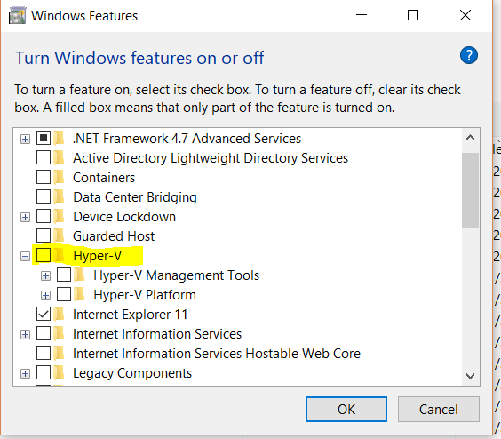

# Running Docker in a Hyper-V VM
<sub>January 2018<sub>

If you are like me and do all your development in a VM, leaving you host OS nice and clean. Then you will have trouble working with Docker. 

My setup uses Windows 10 Pro as my host machine(Named:Mother) and Hyper-V to run virtual machines. Lets call the virtual machine I do my development in Child7. 

## Configure Nested Virtualization
The first issue I came across is that Docker requires Hyper-V to run and Hyper-V requires Virtualization enabled. However Virtualization is disabled inside Child7. 

To enable virtualization in Child7: 
- Open a PowerShell window as Administrator on Mother.
- run 
```Set-VMProcessor -VMName Child7 -ExposeVirtualizationExtensions $true``` 

<sub>Remember to replace Child7 with the name of your VM.<sub> 

This should now allow you to host VM's in your VM.

## Install Hyper-V
Hyper-V can be installed via Turn Windows features on or off.



Or, the Docker installer should do it for you.

## Fixing Insufficient memory issues

The Docker installer will create a Virtual machine (MobyLinuxVM) in your development virtual machine (Child7). If Child7 is set to use Dynamic Memory then chances are Moby will throw an insufficient memory error along the lines of Not enough memory to start docker. 

Depending on how much RAM Mother has, you could increase the Startup RAM for Child7 or reduce the Startup RAM for Moby or both. These settings changes can be done via the Hyper-V manager.


## Further Reading/Resources
[Hyper-V Requirements](https://docs.microsoft.com/en-us/virtualization/hyper-v-on-windows/reference/hyper-v-requirements)

[Enable Nested Virtualization](https://docs.microsoft.com/en-us/virtualization/hyper-v-on-windows/user-guide/nested-virtualization)

[Installing Docker](https://docs.docker.com/docker-for-windows/install/)
